# 🔬 Multi-Agent AI Deep Researcher

> **Enterprise-grade AI research orchestration system leveraging specialized agents for comprehensive, multi-source investigations**

[](https://www.python.org/downloads/)
[](https://streamlit.io/)
[](https://langchain.com/)
[](https://langchain.com/langgraph)
[](https://opensource.org/licenses/MIT)

---

## 📋 Table of Contents

- [Overview](#-overview)
- [Architecture](#-architecture)
  - [System Architecture](#system-architecture-diagram)
  - [Data Flow](#data-flow-diagram)
  - [Sequence Diagrams](#sequence-diagrams)
- [Features & EPICS](#-features--epics)
- [Project Structure](#-project-structure)
- [Agent Details](#-agent-details)
- [Technologies](#-technologies-used)
- [Prerequisites](#-prerequisites)
- [Installation](#-installation)
- [Configuration](#-configuration)
- [Usage](#-usage)
- [API Integration](#-api-integration)
- [Cost Management](#-cost-management)
- [Testing](#-testing)
- [Deployment](#-deployment)
- [Troubleshooting](#-troubleshooting)
- [Contributing](#-contributing)
- [License](#-license)

---

## 🎯 Overview

The **Multi-Agent AI Deep Researcher** is an advanced, production-ready research orchestration platform that coordinates multiple specialized AI agents to conduct deep, comprehensive investigations across diverse knowledge domains.

### 🌟 Key Highlights

- **Multi-Agent Orchestration**: Parallel execution of specialized research agents
- **Cost-Optimized**: Smart routing via OpenRouter with real-time cost tracking
- **Domain-Specific**: Tailored prompts for Stock Market, Medical Research, Technology, and Academic domains
- **Source Diversification**: Web (Perplexity), Videos (YouTube), Academic (arXiv), News APIs
- **RAG Pipeline**: Vector-based retrieval with ChromaDB for enhanced context
- **Real-Time Tracking**: Live progress updates, token usage, and cost estimation
- **Export Capabilities**: PDF, Markdown, JSON, and DOCX formats
- **Enterprise Features**: Caching, rate limiting, error handling, and audit trails

### 🎓 Use Cases

- **Financial Analysis**: Deep-dive stock market research with sentiment analysis
- **Medical Research**: Evidence-based analysis from academic papers and clinical trials
- **Technology Trends**: Comprehensive tech landscape analysis from multiple sources
- **Academic Research**: Multi-source validation with contradiction detection
- **Competitive Intelligence**: Market research with cross-source verification

---

## 🏗️ Architecture

### System Architecture Diagram

```mermaid
graph TB
    subgraph "Frontend Layer"
        UI[Streamlit UI]
        Sidebar[Settings & Config]
        Display[Results Display]
    end
    
    subgraph "Orchestration Layer"
        Orchestrator[LangGraph Orchestrator]
        StateManager[State Management]
        Coordinator[Agent Coordinator]
    end
    
    subgraph "Agent Layer"
        P_Agent[Perplexity Agent<br/>🌐 Web Research]
        Y_Agent[YouTube Agent<br/>📹 Video Analysis]
        API_Agent[API Agent<br/>📚 Academic & News]
        RAG_Agent[RAG Agent<br/>🧠 Vector Search]
    end
    
    subgraph "Service Layer"
        P_Service[Perplexity Service]
        Y_Service[YouTube Service]
        News_Service[News API Service]
        ArXiv_Service[arXiv Service]
        Vector_Service[ChromaDB Service]
    end
    
    subgraph "Data Layer"
        Cache[(Cache Storage)]
        Vector[(Vector DB<br/>ChromaDB)]
        History[(Research History)]
        Exports[(Export Files)]
    end
    
    subgraph "External APIs"
        Perplexity_API[Perplexity AI API]
        YouTube_API[YouTube Data API v3]
        News_API[NewsAPI]
        ArXiv_API[arXiv API]
        OpenRouter[OpenRouter]
    end
    
    UI --> Orchestrator
    Sidebar --> Orchestrator
    Orchestrator --> StateManager
    Orchestrator --> Coordinator
    
    Coordinator --> P_Agent
    Coordinator --> Y_Agent
    Coordinator --> API_Agent
    Coordinator --> RAG_Agent
    
    P_Agent --> P_Service
    Y_Agent --> Y_Service
    API_Agent --> News_Service
    API_Agent --> ArXiv_Service
    RAG_Agent --> Vector_Service
    
    P_Service --> Perplexity_API
    P_Service --> OpenRouter
    Y_Service --> YouTube_API
    News_Service --> News_API
    ArXiv_Service --> ArXiv_API
    Vector_Service --> Vector
    
    Orchestrator --> Cache
    Orchestrator --> History
    Display --> Exports
    
    StateManager -.-> Cache
    Coordinator -.-> History
    
    style UI fill:#667eea,stroke:#333,stroke-width:2px,color:#fff
    style Orchestrator fill:#f093fb,stroke:#333,stroke-width:2px,color:#fff
    style P_Agent fill:#4facfe,stroke:#333,stroke-width:2px,color:#fff
    style Y_Agent fill:#43e97b,stroke:#333,stroke-width:2px,color:#fff
    style API_Agent fill:#fa709a,stroke:#333,stroke-width:2px,color:#fff
    style RAG_Agent fill:#feca57,stroke:#333,stroke-width:2px,color:#000
```



### Data Flow Diagram


### Component Interaction Sequence


### Agent Workflow State Machine


---

## 🚀 Features & EPICS

### EPIC 1: Multi-Agent Research Orchestration

**Description**: Implement a LangGraph-based orchestration system that coordinates multiple specialized AI agents to perform comprehensive research tasks.

#### Features

##### Feature 1.1: LangGraph Workflow Engine
**User Story**: As a researcher, I want the system to automatically coordinate multiple agents so that I can get comprehensive results without manual intervention.

**Acceptance Criteria**:
- ✅ LangGraph workflow initializes with ResearchState
- ✅ Supports parallel agent execution
- ✅ Handles agent failures gracefully with fallbacks
- ✅ State is persisted across agent transitions
- ✅ Workflow completes within configured timeout (default 5 min)
- ✅ Progress updates streamed to UI in real-time

**Implementation Details**:
```python
# File: workflows/langgraph_workflow.py
class ResearchState(TypedDict):
    query: str
    domain: str
    selected_agents: List[str]
    agent_results: Dict[str, Any]
    consolidated_result: Optional[Dict]
    errors: List[str]
    metadata: Dict[str, Any]
```

##### Feature 1.2: Agent Coordinator
**User Story**: As a system, I need to manage agent lifecycles so that resources are efficiently allocated and released.

**Acceptance Criteria**:
- ✅ Agents are initialized on-demand
- ✅ Supports up to 4 concurrent agents
- ✅ Memory limits enforced per agent
- ✅ Agents timeout after configured duration
- ✅ Failed agents don't block others
- ✅ Results cached for identical queries (1 hour TTL)

**Technical Requirements**:
- Python 3.13+ with asyncio
- Memory limit: 2GB per agent
- CPU limit: 2 cores shared
- Network timeout: 30 seconds per API call

---

### EPIC 2: Perplexity Web Research Agent

**Description**: Integrate Perplexity AI for deep web research with domain-specific prompting and structured output parsing.

#### Features

##### Feature 2.1: Perplexity API Integration
**User Story**: As a researcher, I want to search the web comprehensively so that I can get the most current and relevant information.

**Acceptance Criteria**:
- ✅ Connects to Perplexity AI API (sonar-pro model)
- ✅ Retrieves 15-20 high-quality sources
- ✅ Returns results within 10-15 seconds
- ✅ Handles rate limits with exponential backoff
- ✅ Parses structured responses (summary, findings, insights)
- ✅ Tracks API usage and costs

**API Configuration**:
```python
# File: services/perplexity_client.py
PERPLEXITY_CONFIG = {
    "model": "sonar-pro",
    "max_tokens": 4000,
    "temperature": 0.2,
    "top_p": 0.9,
    "search_recency_filter": "month",
    "return_images": False,
    "return_related_questions": True
}
```

##### Feature 2.2: Domain-Specific Prompting
**User Story**: As a domain expert, I want specialized prompts for my field so that research is more accurate and relevant.

**Acceptance Criteria**:
- ✅ Stock market prompts include financial metrics
- ✅ Medical prompts reference evidence-based sources
- ✅ Technology prompts focus on recent developments
- ✅ Academic prompts emphasize peer-reviewed sources
- ✅ Prompts are loaded dynamically based on domain selection
- ✅ Custom prompts can be added via configuration

**Supported Domains**:
1. Stock Market Analysis
2. Medical Research
3. Technology Trends
4. Academic Research
5. General Research (fallback)

---

### EPIC 3: YouTube Sentiment Analysis Agent

**Description**: Analyze YouTube videos for public opinion and sentiment on research topics.

#### Features

##### Feature 3.1: YouTube Search & Transcript Extraction
**User Story**: As a researcher, I want to analyze video content so that I can understand public sentiment and expert opinions.

**Acceptance Criteria**:
- ✅ Searches YouTube API for top 10 relevant videos
- ✅ Extracts video transcripts (or auto-captions)
- ✅ Handles videos without transcripts gracefully
- ✅ Respects YouTube API quota limits
- ✅ Caches video data for 24 hours
- ✅ Returns video metadata (views, likes, publish date)

**API Requirements**:
- YouTube Data API v3 key required
- Quota: 10,000 units/day (free tier)
- Search cost: 100 units per query
- Transcript extraction: Free (no quota)

##### Feature 3.2: Sentiment Analysis
**User Story**: As a researcher, I want to know public opinion so that I can gauge market sentiment or controversy.

**Acceptance Criteria**:
- ✅ Analyzes sentiment (positive/negative/neutral)
- ✅ Identifies key themes across videos
- ✅ Detects controversial or contradictory opinions
- ✅ Summarizes expert vs. public perspectives
- ✅ Generates confidence scores per sentiment
- ✅ Visualizes sentiment distribution

**Sentiment Metrics**:
```python
{
    "overall_sentiment": "positive|negative|neutral|mixed",
    "confidence_score": 0.0-1.0,
    "sentiment_distribution": {
        "positive": 0.65,
        "negative": 0.20,
        "neutral": 0.15
    },
    "key_themes": ["theme1", "theme2", ...],
    "controversy_detected": bool
}
```

---

### EPIC 4: API Agent - Academic & News Aggregation

**Description**: Aggregate data from academic databases (arXiv) and news APIs for comprehensive research.

#### Features

##### Feature 4.1: arXiv Academic Paper Search
**User Story**: As an academic researcher, I want to access peer-reviewed papers so that my research is evidence-based.

**Acceptance Criteria**:
- ✅ Searches arXiv for relevant papers (max 10)
- ✅ Filters by recency (last 3 years default)
- ✅ Returns paper abstracts, authors, citations
- ✅ Provides arXiv IDs for full paper access
- ✅ Ranks papers by relevance score
- ✅ Handles API timeouts with retry logic

**arXiv Query Format**:
```python
# File: services/arxiv_client.py
query_params = {
    "search_query": f"all:{user_query}",
    "max_results": 10,
    "sortBy": "relevance",
    "sortOrder": "descending"
}
```

##### Feature 4.2: News API Integration
**User Story**: As a researcher, I want current news articles so that my research includes the latest developments.

**Acceptance Criteria**:
- ✅ Fetches top 10 news articles from NewsAPI
- ✅ Filters by language (English default)
- ✅ Returns articles from last 30 days
- ✅ Includes source credibility ratings
- ✅ Deduplicates similar articles
- ✅ Respects API rate limits (100 requests/day free tier)

**News Sources Supported**:
- BBC News, Reuters, The Guardian
- TechCrunch, Wired, Ars Technica
- Nature, Science Daily, Medical News
- Bloomberg, Financial Times, WSJ

---

### EPIC 5: RAG System with Vector Database

**Description**: Implement Retrieval-Augmented Generation using ChromaDB for contextual research enhancement.

#### Features

##### Feature 5.1: Document Chunking & Embedding
**User Story**: As a system, I need to efficiently store and retrieve document chunks so that I can provide relevant context to agents.

**Acceptance Criteria**:
- ✅ Documents chunked into 512-token segments
- ✅ Embeddings generated using OpenAI text-embedding-ada-002
- ✅ Embeddings stored in ChromaDB
- ✅ Metadata includes source, timestamp, domain
- ✅ Supports batch processing (100 docs/batch)
- ✅ Handles PDF, TXT, MD, DOCX file formats

**Chunking Strategy**:
```python
# File: utils/chunking.py
CHUNK_CONFIG = {
    "chunk_size": 512,
    "chunk_overlap": 50,
    "separator": "\n\n",
    "keep_separator": True
}
```

##### Feature 5.2: Vector Similarity Search
**User Story**: As a researcher, I want relevant context from past research so that I can build on existing knowledge.

**Acceptance Criteria**:
- ✅ Semantic search returns top 5 similar chunks
- ✅ Similarity threshold: 0.7 (cosine similarity)
- ✅ Results include source attribution
- ✅ Search completes within 200ms
- ✅ Supports filtering by domain/date
- ✅ Re-ranking based on recency and relevance

**Query Performance**:
- Average latency: 150ms
- P99 latency: 300ms
- Throughput: 100 queries/sec
- Index size: ~500MB for 10K documents

---

### EPIC 6: Cost Tracking & Management

**Description**: Real-time tracking and optimization of API costs across all agents.

#### Features

##### Feature 6.1: Token Usage Tracking
**User Story**: As a budget-conscious user, I want to see real-time costs so that I can control spending.

**Acceptance Criteria**:
- ✅ Tracks tokens per agent (input + output)
- ✅ Calculates cost based on model pricing
- ✅ Displays running total during execution
- ✅ Warns when approaching budget limits
- ✅ Stores cost history per session
- ✅ Exports cost reports (CSV, JSON)

**Cost Structure**:
```python
# File: config/constants.py
AGENT_COSTS = {
    "perplexity": 0.002,  # $2 per 1K requests
    "youtube": 0.000,     # Free (API quota only)
    "api_agent": 0.001,   # Mostly free APIs
    "rag": 0.001          # Embedding costs
}
```

##### Feature 6.2: Budget Controls
**User Story**: As an administrator, I want to set spending limits so that costs don't exceed budget.

**Acceptance Criteria**:
- ✅ Max cost per query configurable (default $2.00)
- ✅ Daily budget limit configurable (default $20.00)
- ✅ Queries blocked when limit reached
- ✅ Email alerts at 80% budget threshold
- ✅ Cost projections based on agent selection
- ✅ Historical cost analytics dashboard

---

### EPIC 7: Results Display & Export

**Description**: User-friendly results presentation with multiple export formats.

#### Features

##### Feature 7.1: Structured Results Display
**User Story**: As a researcher, I want well-organized results so that I can quickly find relevant information.

**Acceptance Criteria**:
- ✅ Results displayed in 4 tabs (Summary, Findings, Insights, Sources)
- ✅ Executive summary prominently displayed
- ✅ Key findings numbered and highlighted
- ✅ Insights presented as cards
- ✅ Sources grouped by agent with confidence scores
- ✅ Clean formatting without XML artifacts

**Display Sections**:
1. **Summary Tab**: 2-3 paragraph executive summary
2. **Findings Tab**: 5-10 bullet-pointed key findings
3. **Insights Tab**: 3-8 actionable insights
4. **Sources Tab**: All sources with metadata

##### Feature 7.2: Multi-Format Export
**User Story**: As a researcher, I want to export results in various formats so that I can share findings with my team.

**Acceptance Criteria**:
- ✅ Export to PDF with formatted layout
- ✅ Export to Markdown for documentation
- ✅ Export to JSON for programmatic access
- ✅ Export to DOCX for editing
- ✅ Includes metadata (timestamp, cost, agents used)
- ✅ Download triggered via single button click

**Export Formats**:
- **PDF**: Professional report with cover page
- **Markdown**: GitHub-compatible markdown
- **JSON**: Complete structured data
- **DOCX**: Editable Microsoft Word format

---

### EPIC 8: Settings & Configuration

**Description**: Comprehensive configuration system for customizing research behavior.

#### Features

##### Feature 8.1: Model Selection
**User Story**: As a power user, I want to choose AI models so that I can optimize for cost or quality.

**Acceptance Criteria**:
- ✅ Supports OpenRouter model selection
- ✅ Dropdown with 10+ model options
- ✅ Displays cost per model
- ✅ Shows model capabilities (context length, speed)
- ✅ Saves preferences per user
- ✅ Validates model availability before execution

**Supported Models** (via OpenRouter):
- Claude Sonnet 3.5
- GPT-4o
- GPT-4 Turbo
- Gemini Pro
- Llama 3 70B
- Mixtral 8x7B

##### Feature 8.2: Performance Tuning
**User Story**: As a user, I want to control performance settings so that I can balance speed and thoroughness.

**Acceptance Criteria**:
- ✅ Timeout configuration (1-15 minutes)
- ✅ Max sources per agent (5-50)
- ✅ Enable/disable caching
- ✅ Parallel vs sequential execution toggle
- ✅ Settings saved to user profile
- ✅ Reset to defaults button

---

## 📁 Project Structure

```
lumina/
│
├── 📄 app.py                         # Main Streamlit application entry point
├── 📄 requirements.txt               # Python dependencies
├── 📄 .env.example                   # Environment variables template
├── 📄 .gitignore                     # Git ignore rules
├── 📄 README.md                      # This file
├── 📄 LICENSE                        # MIT License
│
├── 📂 .streamlit/                    # Streamlit configuration
│   └── config.toml                   # Theme and server settings
│
├── 📂 agents/                        # Agent implementations
│   ├── __init__.py
│   ├── base_agent.py                 # Abstract base agent class
│   ├── orchestrator.py               # Main agent orchestrator
│   ├── perplexity_agent.py          # Perplexity web research agent
│   ├── youtube_agent.py             # YouTube sentiment analysis agent
│   ├── api_agent.py                 # Academic & news API agent
│   └── rag_agent.py                 # RAG-based context agent
│
├── 📂 models/                        # Data models & schemas
│   ├── __init__.py
│   ├── research_state.py            # LangGraph state model
│   ├── agent_result.py              # Agent response schema
│   └── research_report.py           # Final report model
│
├── 📂 services/                      # External API clients
│   ├── __init__.py
│   ├── perplexity_client.py        # Perplexity API wrapper
│   ├── youtube_client.py           # YouTube Data API wrapper
│   ├── news_client.py              # NewsAPI wrapper
│   ├── arxiv_client.py             # arXiv API wrapper
│   ├── openrouter_client.py        # OpenRouter API client
│   └── chromadb_client.py          # ChromaDB vector store
│
├── 📂 workflows/                     # LangGraph workflows
│   ├── __init__.py
│   ├── langgraph_workflow.py       # Main research workflow
│   ├── agent_coordinator.py        # Agent coordination logic
│   └── consolidation.py            # Result consolidation
│
├── 📂 prompts/                       # Domain-specific prompts
│   ├── __init__.py
│   ├── base_prompts.py             # Base prompt templates
│   ├── stock_analysis.py           # Stock market "God prompts"
│   ├── medical_research.py         # Medical research prompts
│   ├── academic_research.py        # Academic research prompts
│   └── technology_trends.py        # Technology trend prompts
│
├── 📂 ui/                            # UI components
│   ├── __init__.py
│   ├── components/
│   │   ├── sidebar.py              # Settings sidebar
│   │   ├── agent_selector.py       # Agent selection UI
│   │   ├── agent_cards.py          # Agent status cards
│   │   ├── cost_tracker.py         # Real-time cost display
│   │   ├── results_display.py      # Results formatting
│   │   └── export_buttons.py       # Export functionality
│   ├── pages/
│   │   ├── 1_Research.py           # Main research interface
│   │   ├── 2_History.py            # Research history viewer
│   │   └── 3_Settings.py           # Configuration page
│   └── styles/
│       └── themes.py               # Custom CSS themes
│
├── 📂 config/                        # Configuration files
│   ├── __init__.py
│   ├── settings.py                 # Application settings
│   └── constants.py                # Constants (costs, domains, etc.)
│
├── 📂 utils/                         # Utility functions
│   ├── __init__.py
│   ├── export.py                   # Export utilities (PDF, MD, JSON)
│   ├── parsers.py                  # Response parsers
│   ├── validators.py               # Input validators
│   ├── logger.py                   # Logging configuration
│   ├── cache.py                    # Caching utilities
│   └── cost_calculator.py          # Cost calculation logic
│
├── 📂 data/                          # Data storage
│   ├── cache/                      # Cached API responses
│   ├── exports/                    # Exported reports
│   ├── history/                    # Research history
│   └── vector_db/                  # ChromaDB storage
│
├── 📂 tests/                         # Test suite
│   ├── __init__.py
│   ├── conftest.py                 # Pytest configuration
│   ├── test_agents/
│   │   ├── test_perplexity_agent.py
│   │   ├── test_youtube_agent.py
│   │   └── test_api_agent.py
│   ├── test_services/
│   │   ├── test_perplexity_client.py
│   │   └── test_chromadb_client.py
│   └── test_workflows/
│       └── test_langgraph_workflow.py
│
├── 📂 scripts/                       # Utility scripts
│   ├── setup_env.sh                # Environment setup (Linux/Mac)
│   ├── setup_env.bat               # Environment setup (Windows)
│   ├── run_app.sh                  # Run application (Linux/Mac)
│   ├── run_app.bat                 # Run application (Windows)
│   ├── check_apis.py               # API key validation
│   └── seed_vector_db.py           # Seed ChromaDB with sample data
│
├── 📂 docs/                          # Documentation
│   ├── API.md                      # API documentation
│   ├── ARCHITECTURE.md             # Architecture details
│   ├── DEPLOYMENT.md               # Deployment guide
│   └── CONTRIBUTING.md             # Contribution guidelines
│
└── 📂 notebooks/                     # Jupyter notebooks
    ├── agent_testing.ipynb         # Agent development notebook
    └── prompt_engineering.ipynb    # Prompt optimization
```

### 📝 File Descriptions

#### Core Application Files

**`app.py`** (Main Entry Point)
- Streamlit application initialization
- Session state management
- Page routing and navigation
- Main research interface
- Real-time progress tracking

**`.env.example`** (Environment Template)
```bash
# API Keys
OPENROUTER_API_KEY=your_openrouter_key_here
PERPLEXITY_API_KEY=your_perplexity_key_here
YOUTUBE_API_KEY=your_youtube_key_here
NEWS_API_KEY=your_news_api_key_here

# Configuration
MAX_COST_PER_QUERY=2.0
DAILY_BUDGET=20.0
DEFAULT_TIMEOUT=300
CACHE_TTL=3600

# Vector DB
CHROMADB_PATH=./data/vector_db
EMBEDDING_MODEL=text-embedding-ada-002

# Logging
LOG_LEVEL=INFO
LOG_FILE=./logs/app.log
```

#### Agent Files

**`agents/base_agent.py`** - Abstract Agent Class
```python
from abc import ABC, abstractmethod
from typing import Dict, Any

class BaseAgent(ABC):
    """Abstract base class for all research agents"""
    
    def __init__(self, config: Dict[str, Any]):
        self.config = config
        self.cost = 0.0
        self.tokens_used = 0
    
    @abstractmethod
    async def execute(self, query: str, context: Dict) -> Dict[str, Any]:
        """Execute agent research task"""
        pass
    
    @abstractmethod
    def get_cost(self) -> float:
        """Return total cost of agent execution"""
        pass
```

**`agents/orchestrator.py`** - Main Orchestrator
- Coordinates all agents via LangGraph
- Manages state transitions
- Handles parallel execution
- Implements fallback strategies
- Tracks overall cost and timing

**`agents/perplexity_agent.py`** - Perplexity Agent
- Deep web research using Perplexity AI
- Domain-specific prompt injection
- Structured output parsing
- Source attribution
- Cost tracking (~$0.002/query)

**`agents/youtube_agent.py`** - YouTube Agent
- Video search via YouTube Data API
- Transcript extraction
- Sentiment analysis
- Public opinion aggregation
- Controversy detection

**`agents/api_agent.py`** - API Agent
- arXiv academic paper search
- NewsAPI integration
- Source credibility rating
- Result deduplication
- Multi-source aggregation

**`agents/rag_agent.py`** - RAG Agent
- Vector similarity search
- Context retrieval from ChromaDB
- Hybrid search (keyword + semantic)
- Re-ranking logic
- Source metadata tracking

#### Service Files

**`services/perplexity_client.py`**
```python
import aiohttp
from typing import Dict, List

class PerplexityClient:
    BASE_URL = "https://api.perplexity.ai"
    
    async def search(self, query: str, model: str = "sonar-pro") -> Dict:
        """Execute Perplexity search"""
        async with aiohttp.ClientSession() as session:
            async with session.post(
                f"{self.BASE_URL}/chat/completions",
                json={
                    "model": model,
                    "messages": [{"role": "user", "content": query}],
                    "max_tokens": 4000,
                    "temperature": 0.2
                },
                headers={"Authorization": f"Bearer {self.api_key}"}
            ) as response:
                return await response.json()
```

**`services/chromadb_client.py`**
- Vector database operations
- Document embedding
- Similarity search
- Collection management
- Metadata filtering

#### Workflow Files

**`workflows/langgraph_workflow.py`**
```python
from langgraph.graph import StateGraph, END
from typing import TypedDict, List

class ResearchState(TypedDict):
    query: str
    domain: str
    selected_agents: List[str]
    agent_results: Dict[str, Any]
    consolidated_result: Optional[Dict]
    errors: List[str]
    
workflow = StateGraph(ResearchState)

# Add agent nodes
workflow.add_node("perplexity", perplexity_agent)
workflow.add_node("youtube", youtube_agent)
workflow.add_node("api_agent", api_agent)
workflow.add_node("consolidate", consolidation_agent)

# Set parallel execution
workflow.add_edge("perplexity", "consolidate")
workflow.add_edge("youtube", "consolidate")
workflow.add_edge("api_agent", "consolidate")
workflow.add_edge("consolidate", END)
```

#### UI Component Files

**`ui/components/agent_selector.py`**
- Agent selection checkboxes
- Cost estimation per agent
- Recommended agent suggestions
- Agent capability descriptions

**`ui/components/cost_tracker.py`**
- Real-time cost display
- Token usage metrics
- Budget progress bar
- Historical cost charts

**`ui/components/results_display.py`**
- Tabbed results interface
- Summary formatting
- Source attribution
- Confidence scoring visualization

---

## 🤖 Agent Details

### 1. Perplexity Agent 🌐

**Purpose**: Deep web research with real-time information retrieval

**Capabilities**:
- Searches 15-20 high-quality web sources
- Returns structured results (summary, findings, insights)
- Domain-specific prompting (Stock, Medical, Tech, Academic)
- Real-time data (news, prices, events)
- Source attribution with confidence scores

**Configuration**:
```python
PERPLEXITY_CONFIG = {
    "model": "sonar-pro",              # Latest model
    "max_tokens": 4000,                # Response length
    "temperature": 0.2,                # Deterministic
    "search_recency_filter": "month",  # Recent sources
    "top_k": 20,                       # Max sources
    "return_images": False,
    "return_related_questions": True
}
```

**Cost**: ~$0.002 per query | **Time**: 10-15 seconds | **Sources**: 15-20

**Output Schema**:
```json
{
  "summary": "Executive summary (2-3 paragraphs)",
  "key_findings": ["Finding 1", "Finding 2", ...],
  "insights": ["Insight 1", "Insight 2", ...],
  "sources": [
    {
      "title": "Source Title",
      "url": "https://...",
      "snippet": "Relevant excerpt",
      "confidence": 0.92,
      "published_date": "2025-10-01"
    }
  ],
  "cost": 0.002,
  "tokens": 1543
}
```

---

### 2. YouTube Agent 📹

**Purpose**: Video content analysis and public sentiment measurement

**Capabilities**:
- Searches top 10 relevant YouTube videos
- Extracts transcripts (or auto-captions)
- Performs sentiment analysis (positive/negative/neutral)
- Identifies key themes and controversies
- Aggregates expert vs. public opinions

**Configuration**:
```python
YOUTUBE_CONFIG = {
    "max_results": 10,
    "order": "relevance",
    "type": "video",
    "videoDuration": "medium",  # 4-20 min videos
    "videoDefinition": "any",
    "relevanceLanguage": "en"
}
```

**Cost**: Free (API quota only) | **Time**: 15-20 seconds | **Videos**: 10

**Output Schema**:
```json
{
  "overall_sentiment": "positive",
  "confidence": 0.78,
  "sentiment_distribution": {
    "positive": 0.65,
    "negative": 0.20,
    "neutral": 0.15
  },
  "key_themes": ["Theme 1", "Theme 2", ...],
  "videos": [
    {
      "title": "Video Title",
      "channel": "Channel Name",
      "views": 125000,
      "likes": 3200,
      "url": "https://youtube.com/watch?v=...",
      "sentiment": "positive",
      "key_points": ["Point 1", "Point 2"]
    }
  ],
  "controversy_detected": false
}
```

---

### 3. API Agent 📚

**Purpose**: Academic papers and news aggregation

**Capabilities**:
- Searches arXiv for academic papers
- Fetches news from NewsAPI
- Filters by recency and relevance
- Ranks sources by credibility
- Deduplicates similar articles

**Configuration**:
```python
API_AGENT_CONFIG = {
    "arxiv": {
        "max_results": 10,
        "sort_by": "relevance",
        "sort_order": "descending"
    },
    "news": {
        "pageSize": 10,
        "language": "en",
        "sortBy": "publishedAt"
    }
}
```

**Cost**: ~$0.001 (mostly free APIs) | **Time**: 8-12 seconds | **Sources**: 10-20

**Output Schema**:
```json
{
  "academic_papers": [
    {
      "title": "Paper Title",
      "authors": ["Author 1", "Author 2"],
      "arxiv_id": "2410.12345",
      "published": "2025-10-01",
      "abstract": "Paper abstract...",
      "citations": 42,
      "url": "https://arxiv.org/abs/2410.12345"
    }
  ],
  "news_articles": [
    {
      "title": "Article Title",
      "source": "BBC News",
      "author": "Author Name",
      "published": "2025-10-05",
      "url": "https://...",
      "credibility_score": 0.95
    }
  ],
  "total_sources": 18
}
```

---

### 4. RAG Agent 🧠

**Purpose**: Context-aware retrieval from vector database

**Capabilities**:
- Semantic similarity search
- Retrieves top 5 relevant chunks
- Hybrid search (keyword + vector)
- Re-ranks by recency and relevance
- Provides source attribution

**Configuration**:
```python
RAG_CONFIG = {
    "embedding_model": "text-embedding-ada-002",
    "chunk_size": 512,
    "chunk_overlap": 50,
    "top_k": 5,
    "similarity_threshold": 0.7,
    "rerank": True
}
```

**Cost**: ~$0.001 (embedding costs) | **Time**: 5-8 seconds | **Chunks**: 5

**Output Schema**:
```json
{
  "retrieved_chunks": [
    {
      "content": "Relevant text chunk...",
      "source": "Document name",
      "similarity": 0.89,
      "metadata": {
        "domain": "technology",
        "timestamp": "2025-09-15",
        "author": "..."
      }
    }
  ],
  "context_summary": "Aggregated context from retrieved chunks"
}
```

---

## 🛠️ Technologies Used

### Core Framework
- **Python 3.13+**: Latest Python with performance improvements
- **Streamlit 1.29.0**: Interactive web UI framework
- **LangChain 0.1.0**: LLM application framework
- **LangGraph 0.0.20**: Agent orchestration and workflow management

### AI & LLM
- **OpenRouter**: Multi-model API gateway for cost optimization
- **Perplexity AI**: Real-time web research (sonar-pro model)
- **OpenAI Embeddings**: text-embedding-ada-002 for RAG

### Vector Database
- **ChromaDB 0.4.18**: Vector store for semantic search
- **FAISS** (optional): Alternative vector database

### Data Sources
- **YouTube Data API v3**: Video search and metadata
- **arXiv API**: Academic paper search
- **NewsAPI**: News article aggregation
- **SerpAPI** (optional): Google search results

### Utilities
- **aiohttp 3.9.1**: Async HTTP client for API calls
- **pandas 2.1.4**: Data manipulation and analysis
- **pytest 7.4.3**: Testing framework
- **python-dotenv**: Environment variable management
- **tenacity**: Retry logic with exponential backoff

### Development Tools
- **Black**: Code formatting
- **Pylint**: Linting and code quality
- **mypy**: Static type checking
- **pre-commit**: Git hooks for code quality

### Export Formats
- **reportlab**: PDF generation
- **python-docx**: DOCX export
- **markdown**: Markdown formatting

---

## 📋 Prerequisites

### System Requirements
- **OS**: Windows 10+, macOS 10.15+, or Linux (Ubuntu 20.04+)
- **Python**: 3.13+ (recommended) or 3.10+
- **RAM**: Minimum 4GB, recommended 8GB
- **Storage**: 2GB free space for dependencies and data

### Required API Keys

1. **OpenRouter** (Required)
   - Sign up: https://openrouter.ai/
   - Cost: Pay-as-you-go, ~$0.001-0.01 per query
   - Usage: Multi-model LLM access

2. **Perplexity AI** (Required)
   - Sign up: https://www.perplexity.ai/
   - Cost: $20/month or $0.002 per query
   - Usage: Deep web research

3. **YouTube Data API v3** (Optional but Recommended)
   - Get key: https://console.cloud.google.com/
   - Cost: Free (10,000 units/day)
   - Usage: Video search and metadata

4. **NewsAPI** (Optional)
   - Get key: https://newsapi.org/
   - Cost: Free tier (100 requests/day)
   - Usage: News article aggregation

5. **OpenAI** (Optional - for embeddings)
   - Sign up: https://platform.openai.com/
   - Cost: ~$0.0001 per 1K tokens
   - Usage: Text embeddings for RAG

### Development Tools (Optional)
- **Git**: Version control
- **Docker**: Containerized deployment
- **VS Code**: Recommended IDE with Python extension

---

## 🚀 Installation

### Step 1: Clone the Repository

```bash
git clone https://github.com/yourusername/lumina.git
cd lumina
```

### Step 2: Create Virtual Environment

**Linux/macOS**:
```bash
python3.13 -m venv venv
source venv/bin/activate
```

**Windows**:
```bash
python -m venv venv
venv\Scripts\activate
```

### Step 3: Install Dependencies

```bash
pip install --upgrade pip
pip install -r requirements.txt
```

**requirements.txt**:
```
# Core Framework
streamlit==1.29.0
langchain==0.1.0
langgraph==0.0.20
openai==1.6.1

# Vector DB
chromadb==0.4.18

# HTTP & Async
aiohttp==3.9.1
requests==2.31.0
httpx==0.25.2

# Data Processing
pandas==2.1.4
numpy==1.26.2
python-dotenv==1.0.0

# Export
reportlab==4.0.7
python-docx==1.1.0
markdown==3.5.1

# Testing
pytest==7.4.3
pytest-asyncio==0.21.1

# Utilities
tenacity==8.2.3
pydantic==2.5.2
python-dateutil==2.8.2
```

### Step 4: Configure Environment Variables

```bash
cp .env.example .env
nano .env  # or use your preferred editor
```

**.env file**:
```bash
# Required
OPENROUTER_API_KEY=sk-or-v1-...
PERPLEXITY_API_KEY=pplx-...

# Optional
YOUTUBE_API_KEY=AIza...
NEWS_API_KEY=...
OPENAI_API_KEY=sk-proj-...

# Configuration
MAX_COST_PER_QUERY=2.0
DAILY_BUDGET=20.0
DEFAULT_TIMEOUT=300
CACHE_TTL=3600

# Database
CHROMADB_PATH=./data/vector_db
EMBEDDING_MODEL=text-embedding-ada-002

# Logging
LOG_LEVEL=INFO
LOG_FILE=./logs/app.log
```

### Step 5: Initialize ChromaDB (Optional)

```bash
python scripts/seed_vector_db.py
```

This creates an empty ChromaDB instance. You can add documents later via the UI.

### Step 6: Verify Installation

```bash
python scripts/check_apis.py
```

This script validates all API keys and checks connectivity.

---

## ⚙️ Configuration

### Application Settings

Edit `config/settings.py`:

```python
# config/settings.py

APP_CONFIG = {
    # Performance
    "max_concurrent_agents": 4,
    "default_timeout": 300,  # seconds
    "max_sources_per_agent": 20,
    
    # Cost Control
    "max_cost_per_query": 2.0,
    "daily_budget": 20.0,
    "warn_threshold": 0.8,  # 80% of budget
    
    # Caching
    "cache_enabled": True,
    "cache_ttl": 3600,  # 1 hour
    
    # RAG
    "chunk_size": 512,
    "chunk_overlap": 50,
    "similarity_threshold": 0.7,
    
    # UI
    "theme": "dark",
    "show_debug_info": False
}
```

### Domain Prompts

Customize prompts in `prompts/` directory:

**`prompts/stock_analysis.py`**:
```python
STOCK_MARKET_PROMPT = """
You are a senior financial analyst with 20 years of experience.

Research the following stock/company: {query}

Provide a comprehensive analysis including:
1. Current stock performance (price, volume, trends)
2. Recent news and events impacting the stock
3. Financial health (revenue, profit, debt, cash flow)
4. Analyst ratings and price targets
5. Risk factors and opportunities
6. Competitive landscape
7. Future outlook

Use the latest data available and cite all sources.
"""
```

### Streamlit Theme

Edit `.streamlit/config.toml`:

```toml
[theme]
primaryColor = "#667eea"
backgroundColor = "#0e1117"
secondaryBackgroundColor = "#1f2937"
textColor = "#fafafa"
font = "sans serif"

[server]
headless = true
port = 8501
enableCORS = false
enableXsrfProtection = true

[browser]
gatherUsageStats = false
```

---

## 🎮 Usage

### Starting the Application

**Linux/macOS**:
```bash
./scripts/run_app.sh
```

**Windows**:
```bash
scripts\run_app.bat
```

**Manual Start**:
```bash
streamlit run app.py
```

The application will open at `http://localhost:8501`

### Basic Workflow

1. **Select Domain** → Choose from Stock Market, Medical, Technology, or Academic
2. **Enter Query** → Type your research question (e.g., "Analyze Tesla stock performance")
3. **Select Agents** → Choose which agents to activate (Perplexity recommended)
4. **Review Estimates** → Check estimated cost and time
5. **Start Research** → Click "Start Research" button
6. **Monitor Progress** → Watch real-time agent execution
7. **Review Results** → Explore Summary, Findings, Insights, and Sources tabs
8. **Export** → Download results in PDF, Markdown, JSON, or DOCX format

### Example Queries

**Stock Market**:
```
"Analyze NVIDIA stock performance and future outlook"
"Compare Tesla vs. Rivian: which is a better investment?"
"What are the top AI stocks to watch in 2025?"
```

**Medical Research**:
```
"Latest research on Alzheimer's treatment options"
"Effectiveness of intermittent fasting for weight loss"
"COVID-19 long-term effects: current understanding"
```

**Technology**:
```
"State of quantum computing in 2025"
"How is AI impacting software development?"
"Blockchain use cases beyond cryptocurrency"
```

**Academic**:
```
"Recent advances in fusion energy research"
"Climate change impact on global food security"
"Effectiveness of different teaching methodologies"
```

### Advanced Features

**1. Custom Agent Selection**:
- Enable/disable specific agents based on needs
- Reduces cost if only certain sources needed
- Perplexity alone often sufficient for quick research

**2. Budget Controls**:
- Set max cost per query in Settings
- Daily budget limits prevent overspending
- Real-time cost tracking during execution

**3. Result Caching**:
- Identical queries use cached results (1-hour TTL)
- Saves time and cost
- Can be disabled in Settings

**4. Export Formats**:
- **PDF**: Professional report with cover page
- **Markdown**: For documentation/wiki
- **JSON**: Programmatic access to structured data
- **DOCX**: Editable Microsoft Word format

---

## 🌐 API Integration

### OpenRouter Integration

**Purpose**: Cost-effective access to multiple LLM models

**Setup**:
```python
# services/openrouter_client.py
import openai

openai.api_base = "https://openrouter.ai/api/v1"
openai.api_key = os.getenv("OPENROUTER_API_KEY")

response = openai.ChatCompletion.create(
    model="anthropic/claude-sonnet-3.5",
    messages=[{"role": "user", "content": query}]
)
```

**Supported Models**:
- Claude Sonnet 3.5 ($3/MTok) - **Recommended**
- GPT-4o ($5/MTok)
- GPT-4 Turbo ($10/MTok)
- Gemini Pro ($0.50/MTok)
- Llama 3 70B ($0.90/MTok)

**Benefits**:
- Single API key for multiple models
- Automatic failover
- Cost tracking per model
- Usage analytics dashboard

---

### Perplexity AI Integration

**Purpose**: Real-time web research with source attribution

**API Endpoint**: `https://api.perplexity.ai/chat/completions`

**Request**:
```python
import aiohttp

async def perplexity_search(query: str):
    async with aiohttp.ClientSession() as session:
        async with session.post(
            "https://api.perplexity.ai/chat/completions",
            json={
                "model": "sonar-pro",
                "messages": [{"role": "user", "content": query}],
                "max_tokens": 4000,
                "temperature": 0.2,
                "search_recency_filter": "month"
            },
            headers={
                "Authorization": f"Bearer {PERPLEXITY_API_KEY}",
                "Content-Type": "application/json"
            }
        ) as response:
            return await response.json()
```

**Response**:
```json
{
  "id": "...",
  "choices": [{
    "message": {
      "content": "Structured research response...",
      "role": "assistant"
    },
    "finish_reason": "stop"
  }],
  "citations": [
    "https://source1.com",
    "https://source2.com"
  ],
  "usage": {
    "prompt_tokens": 125,
    "completion_tokens": 1418,
    "total_tokens": 1543
  }
}
```

**Rate Limits**:
- Free tier: 5 requests/hour
- Pro tier ($20/month): 300 requests/day
- Enterprise: Custom limits

---

### YouTube Data API v3

**Purpose**: Video search and metadata retrieval

**Endpoints Used**:
1. **Search**: `youtube.search().list()`
2. **Videos**: `youtube.videos().list()`
3. **Captions**: `youtube.captions().list()` (requires OAuth)

**Search Example**:
```python
from googleapiclient.discovery import build

youtube = build('youtube', 'v3', developerKey=YOUTUBE_API_KEY)

request = youtube.search().list(
    part="snippet",
    q=query,
    type="video",
    maxResults=10,
    order="relevance",
    videoDefinition="any",
    relevanceLanguage="en"
)

response = request.execute()
```

**Quota Costs**:
- Search: 100 units per query
- Video details: 1 unit per video
- Daily quota: 10,000 units (free tier)
- Cost: ~100-110 units per research query

---

### NewsAPI

**Purpose**: Recent news article aggregation

**Endpoint**: `https://newsapi.org/v2/everything`

**Request**:
```python
import requests

response = requests.get(
    "https://newsapi.org/v2/everything",
    params={
        "q": query,
        "language": "en",
        "sortBy": "publishedAt",
        "pageSize": 10,
        "apiKey": NEWS_API_KEY
    }
)

articles = response.json()["articles"]
```

**Rate Limits**:
- Free tier: 100 requests/day
- Developer: 250 requests/day ($449/month)
- Business: 1,000 requests/day ($1,999/month)

---

### arXiv API

**Purpose**: Academic paper search

**Endpoint**: `http://export.arxiv.org/api/query`

**Request**:
```python
import requests
import xml.etree.ElementTree as ET

response = requests.get(
    "http://export.arxiv.org/api/query",
    params={
        "search_query": f"all:{query}",
        "start": 0,
        "max_results": 10,
        "sortBy": "relevance",
        "sortOrder": "descending"
    }
)

# Parse XML response
root = ET.fromstring(response.content)
papers = [entry for entry in root.findall("{http://www.w3.org/2005/Atom}entry")]
```

**Features**:
- No API key required
- No rate limits (be respectful)
- Free forever
- Metadata includes: title, authors, abstract, arXiv ID, categories

---

## 💰 Cost Management

### Cost Breakdown

**Per Query Estimates**:

| Agent | Cost | Time | Sources |
|-------|------|------|---------|
| Perplexity | $0.002 | 10-15s | 15-20 |
| YouTube | Free* | 15-20s | 10 |
| API Agent | $0.001 | 8-12s | 10-20 |
| RAG | $0.001 | 5-8s | 5 |
| **Total** | **$0.004** | **~30s** | **40-55** |

*YouTube uses API quota, not monetary cost

### Monthly Cost Projections

**Light Usage** (10 queries/day):
- Daily: $0.04
- Monthly: $1.20
- Annual: $14.60

**Medium Usage** (50 queries/day):
- Daily: $0.20
- Monthly: $6.00
- Annual: $73.00

**Heavy Usage** (200 queries/day):
- Daily: $0.80
- Monthly: $24.00
- Annual: $292.00

### Cost Optimization Strategies

1. **Agent Selection**: Disable unneeded agents
2. **Caching**: Enable 1-hour result caching
3. **Model Selection**: Use cheaper models via OpenRouter
4. **Batch Queries**: Research related topics together
5. **Budget Limits**: Set daily/query maximums

### Cost Tracking Features

**Real-Time Display**:
- Current query cost
- Running total
- Budget remaining
- Cost per agent breakdown

**Historical Analytics**:
- Cost trends over time
- Most expensive queries
- Agent cost distribution
- Daily/weekly/monthly summaries

**Export**:
```bash
# Export cost history as CSV
python scripts/export_costs.py --format csv --output costs.csv

# Generate cost report
python scripts/generate_cost_report.py --month 2025-10
```

---

## 🧪 Testing

### Running Tests

**All Tests**:
```bash
pytest
```

**Specific Test Suite**:
```bash
pytest tests/test_agents/
pytest tests/test_services/
pytest tests/test_workflows/
```

**With Coverage**:
```bash
pytest --cov=agents --cov=services --cov=workflows --cov-report=html
```

### Test Structure

```
tests/
├── conftest.py              # Shared fixtures
├── test_agents/
│   ├── test_perplexity_agent.py
│   ├── test_youtube_agent.py
│   └── test_api_agent.py
├── test_services/
│   ├── test_perplexity_client.py
│   └── test_chromadb_client.py
└── test_workflows/
    └── test_langgraph_workflow.py
```

### Example Test

```python
# tests/test_agents/test_perplexity_agent.py
import pytest
from agents.perplexity_agent import PerplexityAgent

@pytest.mark.asyncio
async def test_perplexity_search():
    agent = PerplexityAgent(config={"api_key": "test_key"})
    result = await agent.execute(
        query="What is quantum computing?",
        context={"domain": "technology"}
    )
    
    assert "summary" in result
    assert "key_findings" in result
    assert len(result["sources"]) > 0
    assert result["cost"] > 0

@pytest.mark.asyncio
async def test_perplexity_timeout():
    agent = PerplexityAgent(config={"timeout": 1})
    
    with pytest.raises(TimeoutError):
        await agent.execute(query="...", context={})
```

---

## 🚢 Deployment

### Local Deployment

Already covered in [Installation](#installation) section.

### Docker Deployment

**Dockerfile**:
```dockerfile
FROM python:3.13-slim

WORKDIR /app

# Install dependencies
COPY requirements.txt .
RUN pip install --no-cache-dir -r requirements.txt

# Copy application
COPY . .

# Expose Streamlit port
EXPOSE 8501

# Health check
HEALTHCHECK CMD curl --fail http://localhost:8501/_stcore/health || exit 1

# Run application
CMD ["streamlit", "run", "app.py", "--server.port=8501", "--server.address=0.0.0.0"]
```

**Build & Run**:
```bash
docker build -t lumina .
docker run -p 8501:8501 --env-file .env lumina
```

### Docker Compose

**docker-compose.yml**:
```yaml
version: '3.8'

services:
  app:
    build: .
    ports:
      - "8501:8501"
    env_file:
      - .env
    volumes:
      - ./data:/app/data
      - ./logs:/app/logs
    restart: unless-stopped
    
  chromadb:
    image: chromadb/chroma:latest
    ports:
      - "8000:8000"
    volumes:
      - chromadb_data:/chroma/chroma
    restart: unless-stopped

volumes:
  chromadb_data:
```

**Start**:
```bash
docker-compose up -d
```

### Cloud Deployment

**Streamlit Cloud** (Recommended):
1. Push code to GitHub
2. Go to https://streamlit.io/cloud
3. Connect repository
4. Add secrets (API keys) in dashboard
5. Deploy

**AWS EC2**:
```bash
# Launch Ubuntu 22.04 instance
# SSH into instance
ssh -i key.pem ubuntu@ec2-x-x-x-x.compute.amazonaws.com

# Install Docker
sudo apt update
sudo apt install docker.io docker-compose -y

# Clone repo
git clone https://github.com/yourusername/lumina.git
cd lumina

# Configure environment
nano .env

# Run
sudo docker-compose up -d
```

**Google Cloud Run**:
```bash
# Build container
gcloud builds submit --tag gcr.io/PROJECT_ID/lumina

# Deploy
gcloud run deploy lumina \
  --image gcr.io/PROJECT_ID/lumina \
  --platform managed \
  --region us-central1 \
  --allow-unauthenticated \
  --set-env-vars OPENROUTER_API_KEY=...
```

---

## 🛠️ Troubleshooting

### Common Issues

#### 1. API Key Errors

**Error**: `Authentication failed: Invalid API key`

**Solution**:
```bash
# Verify .env file exists
ls -la .env

# Check API key format
cat .env | grep API_KEY

# Test API keys
python scripts/check_apis.py
```

#### 2. Module Import Errors

**Error**: `ModuleNotFoundError: No module named 'langchain'`

**Solution**:
```bash
# Verify virtual environment is activated
which python  # Should show venv/bin/python

# Reinstall dependencies
pip install -r requirements.txt --force-reinstall
```

#### 3. Streamlit Connection Error

**Error**: `Could not connect to Streamlit server`

**Solution**:
```bash
# Kill existing Streamlit processes
pkill -f streamlit

# Restart Streamlit
streamlit run app.py --server.port 8502
```

#### 4. ChromaDB Initialization Error

**Error**: `chromadb.errors.ChromaError: Could not connect to database`

**Solution**:
```bash
# Delete corrupted database
rm -rf ./data/vector_db

# Reinitialize
python scripts/seed_vector_db.py
```

#### 5. Timeout Errors

**Error**: `asyncio.TimeoutError: Agent execution timed out`

**Solution**:
```python
# Increase timeout in config/settings.py
APP_CONFIG = {
    "default_timeout": 600,  # 10 minutes
}
```

### Debug Mode

Enable debug logging:

```python
# utils/logger.py
import logging

logging.basicConfig(
    level=logging.DEBUG,
    format='%(asctime)s - %(name)s - %(levelname)s - %(message)s',
    handlers=[
        logging.FileHandler('logs/debug.log'),
        logging.StreamHandler()
    ]
)
```

### Performance Issues

**Slow Response Times**:
1. Check internet connection
2. Verify API endpoints are reachable
3. Reduce `max_sources_per_agent`
4. Enable caching
5. Use faster models (Gemini, Llama)

**High Memory Usage**:
1. Reduce `max_concurrent_agents` to 2
2. Clear cache regularly
3. Limit vector database size
4. Use pagination for large result sets

---

## 🤝 Contributing

We welcome contributions! Please follow these guidelines:

### Development Setup

1. Fork the repository
2. Create a feature branch: `git checkout -b feature/amazing-feature`
3. Install dev dependencies: `pip install -r requirements-dev.txt`
4. Make your changes
5. Run tests: `pytest`
6. Commit: `git commit -m 'Add amazing feature'`
7. Push: `git push origin feature/amazing-feature`
8. Open a Pull Request

### Code Style

- Follow PEP 8
- Use Black for formatting: `black .`
- Type hints required for all functions
- Docstrings for all public methods (Google style)

### Testing Requirements

- Add tests for all new features
- Maintain >80% code coverage
- All tests must pass before PR approval

### Documentation

- Update README.md for user-facing changes
- Add docstrings for all new functions
- Update CHANGELOG.md

---

## 📄 License

This project is licensed under the MIT License - see the [LICENSE](LICENSE) file for details.

---

## 🙏 Acknowledgments

- **Perplexity AI** for real-time web research capabilities
- **LangChain** for the agent orchestration framework
- **Streamlit** for the amazing UI framework
- **OpenRouter** for multi-model access
- **Anthropic** for Claude models

---

## 📧 Contact & Support

- **Issues**: https://github.com/karwasanjay007/lumina/issues
- **Discussions**: https://github.com/karwasanjay007/lumina/discussions
- **Email**: **Maintainer**: karwasanjay007@gmail.com
- **Discord**: [Join our Discord](https://discord.gg/...)

---

## 🗺️ Roadmap

### Q4 2025
- ✅ Core multi-agent system
- ✅ Perplexity integration
- 🔄 YouTube sentiment analysis
- 🔄 API agent (arXiv + News)
- 🔄 RAG system with ChromaDB

### Q1 2026
- 📅 Custom domain prompts
- 📅 Advanced cost analytics
- 📅 Team collaboration features
- 📅 API access for developers
- 📅 Mobile app (iOS/Android)

### Q2 2026
- 📅 Multi-language support
- 📅 Voice input/output
- 📅 Advanced visualizations
- 📅 Scheduled research tasks
- 📅 Integration with Slack/Teams

---

**Version**: 0.1.0  
**Last Updated**: October 5, 2025  
**Maintainer**: karwasanjay007@gmail.com

